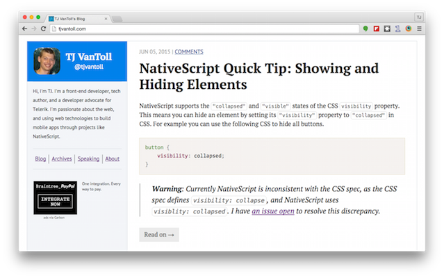

# TJ VanToll's Blog

This repo contains the source code for <https://www.tjvantoll.com>, my personal home page and blog. The site is built on top of [Jekyll](http://jekyllrb.com/).



## Running

To run the site for yourself clone the repo and run `jekyll serve` from your command-line interface of choice.

```
$ git clone https://github.com/tjvantoll/www.tjvantoll.com.git
$ cd www.tjvantoll.com
$ jekyll serve
```

## License

The code that builds this site is [licensed under the MIT license](LICENSE), and the articles in `_posts` are licensed under the [Creative Commons Attribution 3.0 License](https://creativecommons.org/licenses/by/3.0/us/). Put plainly, you're free to use this repo's code in any way you'd like, including in commerical projects. You may use the content of the articles in `_posts`, but if you do so you must provide appropriate attribution (a link back to the article on <https://www.tjvantoll.com> is cool), and indicate if any changes were made.
